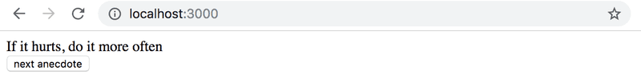

# Exercise 1.12 - 1.15

## Step 1 ##

The world of software engineering is filled with anecdotes that distill timeless truths from our field into short one-liners.

Expand the following application by adding a button that can be clicked to display a random anecdote from the field of software engineering.

Content of the file main.jsx is the same as in previous exercises.

Find out how to generate random numbers in JavaScript, eg. via a search engine or on Mozilla Developer Network. Remember that you can test generating random numbers e.g. straight in the console of your browser.

Your finished application could look something like this:
[]
