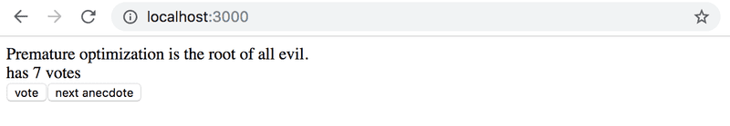
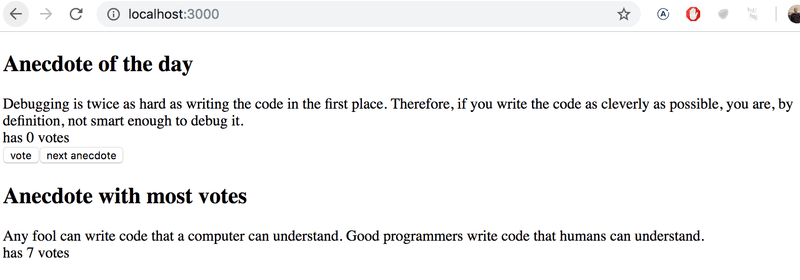

# Exercise 1.12 - 1.15 - Anecdotes #

## Step 1 ##

The world of software engineering is filled with anecdotes that distill timeless truths from our field into short one-liners.

Expand the following application by adding a button that can be clicked to display a random anecdote from the field of software engineering.

Content of the file main.jsx is the same as in previous exercises.

Find out how to generate random numbers in JavaScript, eg. via a search engine or on Mozilla Developer Network. Remember that you can test generating random numbers e.g. straight in the console of your browser.

Your finished application could look something like this:


## 1.13: anecdotes step2 ##

Expand your application so that you can vote for the displayed anecdote.



NB store the votes of each anecdote into an array or object in the component's state. Remember that the correct way of updating state stored in complex data structures like objects and arrays is to make a copy of the state.

You can create a copy of an object like this:

```jsx
const points = { 0: 1, 1: 3, 2: 4, 3: 2 }

const copy = { ...points }
// increment the property 2 value by one
copy[2] += 1     
```

OR a copy of an array like this:

```jsx
const points = [1, 4, 6, 3]

const copy = [...points]
// increment the value in position 2 by one
copy[2] += 1     
``` 

Using an array might be the simpler choice in this case. Searching the Internet will provide you with lots of hints on how to [create a zero-filled array of the desired length](https://stackoverflow.com/questions/20222501/how-to-create-a-zero-filled-javascript-array-of-arbitrary-length/22209781).

## 1.14*: anecdotes step3 ##

Now implement the final version of the application that displays the anecdote with the largest number of votes:


If multiple anecdotes are tied for first place it is sufficient to just show one of them.

This was the last exercise for this part of the course and it's time to push your code to GitHub and mark all of your finished exercises to the "my submissions" tab of the [submission application](https://studies.cs.helsinki.fi/stats/courses/fullstackopen).